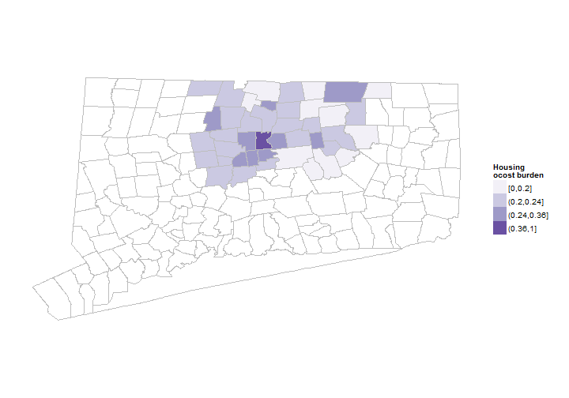
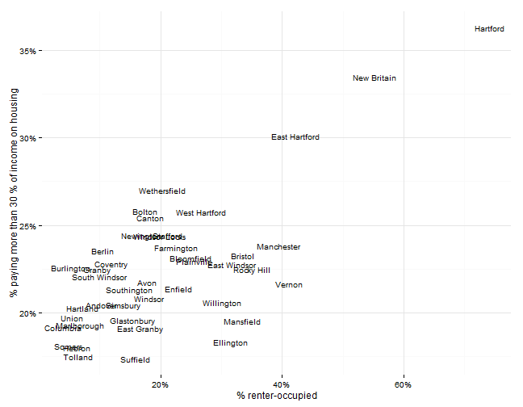
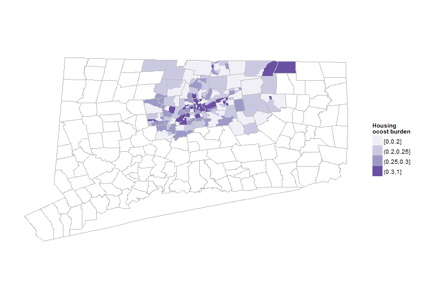

## Housing indicators

Indicators related to the cost of housing and affordable housing will be covered here, primarily the percent of owners paying more than a given share of income for housing, typically 30 percent of income. Other measures of homeownership and the availability of subsidized housing are also covered. 

## Data and limitations

The standard measure of affordable housing is the percent of homeowners that pay more than 30 percent of income for housing. In some cases, the threshold is different (50% or 70%), allowing for identification of severe hig cost burdens. The source for this indicator is the U.S. Census Bureau's American Community Survey, the annual sample survey, and the decennial census.  

Two other measures are used occasionally: measures of housing affordability, from either state agencies or private firms like Moody's or the Warren Group, or measures of the stock of affordable (or subsidized) housing, again typically from state agencies (here, the Connecticut Housing Finance Authority). Below are examples for both of these.

Limitations for this indicator are the reliance on ACS data which can have high margins of error for small communities and the exclusion of some individuals from the survey if their housing costs cannot be identified.. [The new Department of Housing](http://www.ct.gov/doh/site/default.asp) may mean better housing data will be available in the future for Connecticut. 

HUD and the Department of Transportion have also just released the [Location Affordability Index](http://www.locationaffordability.info/lai.aspx) a combined housing cost + transit mapping tool, which providers information by census tract. [Maps of the region](http://locationaffordability.info/lai.aspx?activeHH=a&activeTheme=a&bounds=%5B%5B%22route%22%5D,41.57226259999999,-72.54966200000001%5D) through this tool show the highest cost regions further from the city.

## What do we already know?

Below are references for some local, regional and national reports that use indicators of affordable housing, with some details on how the data is used. 

### Local

* [Health Equity Index](http://www.cadh.org/health-equity/health-equity-index.html) includes two housing indicators - owners paying more than 30 percent and the number of subsidized housing units per 1000 residents - as factors in their model. The Hartford health needs assessment discusses data on Hartford, where 'Hartford received the overall lowest housing score' in the state on the index.  
* [Pioneer Valley State of the People](http://pvpc.org/resources/datastats/state-of-people/stateofthepeople2013.pdf) includes the 30 percent of income indicator along with indicators for housing affordability and availability of subsidized housing. Data for these comes from the Census, the Warren Group and the Massachusetts Dept. of Housing and Economic Development. 
* [Sustainable Knowledge Corridor Dashboard](http://www.sustainableknowledgecorridor.org/site/content/how-are-we-doing) includes a section on housing, including the housing cost burden. 
* [Population Results Working Group](http://www.ct.gov/opm/cwp/view.asp?a=2998&Q=490946) cites the same '30 percent of income' as an indicator to track. 
* [Opportunities Hartford](http://www.cahs.org/programs-opportunitieshartford.asp) includes the '30 percent of income' indicator within a set of indicators and performance measures. 
* [Data Haven's Community Well-Being Index](http://www.ctdatahaven.org/communityindex) includes the '30 percent of income' indicator within it's index. The report notes that 'Housing cost data do not consider the impact of transportation costs within cities. In some cases, cities with the highest housing costs are actually cheaper to live in than their surrounding suburban areas, because the need for car ownership is reduced.'

### Other relevant efforts

* [Boston Indicators Project](http://www.bostonindicators.org/) looks at the share of income spent on housing, along with the percent of housing stock that is affordable (via Massachsuetts Department of Housing & Community Development) and a combined housing and transit cost burden (via MassGIS. 
* [What Matters to Metros](http://www.futurefundneo.org/whatmatters) includes the '30 percent of income' indicator along with a general cost-of-living index from Moody's.

## Sample results

For housing issues, a first check is the rate of renting vs. owning in each town. For the state, Hartford has the lowest rate of owner-occupancy, based on 2006 - 2010 data from the American Community Survey. 

Most of the following results are based on Hartford and Tolland counties, not the CRCOG region, since it is easier to extract ACS data that way. But these could all be modified for any given geography. 

 

Rural areas tend to have higher home ownership rates throughout the state, not suprisingly. 

 

Data on housing cost burden show the highest cost burdens in Hartford and some of the inner-ring suburbs, and the lowest costs relative to income in outer-ring and rural towns, particularly Suffield and Tolland. 

 

Since the data is from the ACS, the margin of error can be high for small towns. The plot below shows that in practice we can't distinguish the differences between many towns in the region. For instance, housing costs in Bolton appear high if we only look at the estimate, but the margin of error indicates they could be anywhere between the costs for East Hartford and Avon. 

 

Housing cost generally appears to be associated with home-ownership rates; costs are lower in towns with higher home-ownership rates. 

 

Using 5-year estimates of census data, we can also make the same map by census tract, similar to a neighborhood (with a few holes). The high cost areas again tend to be clustered around Hartford, with lower housing cost burdens in rural and affluent areas. 

 

While some projects have used data on the number of subsidized housing units (per 1000 residents) for Connecticut, this data is not readily available. It could likely be requested from CHFA if seen as important. 

Additional breakouts of housing costs by other demographics (race, age, ethnicity) are available from the Census data.  
